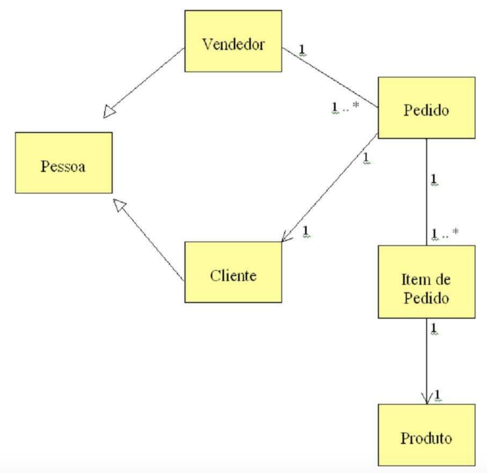
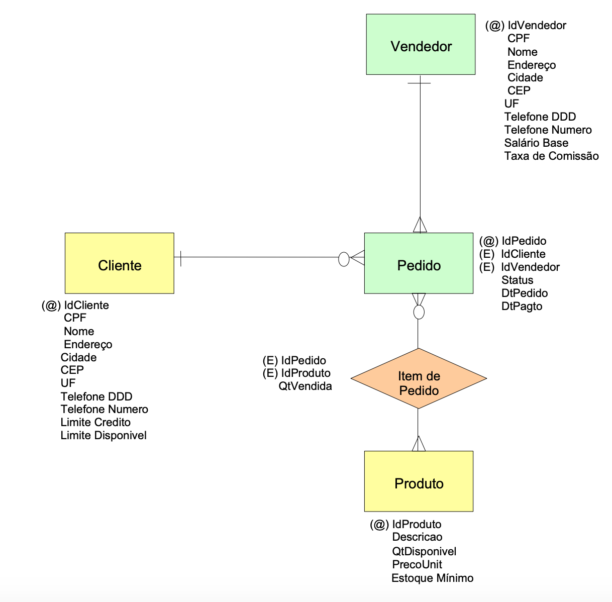
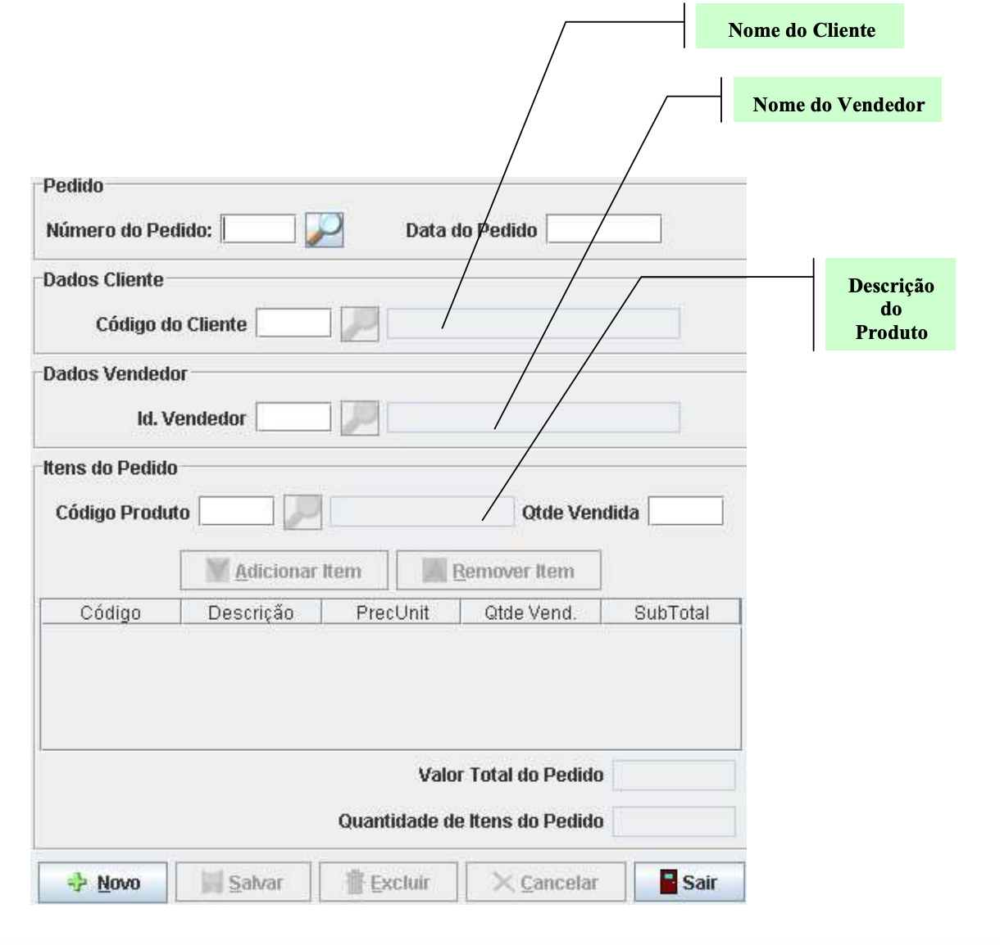

# salesControl

## Diagrama de Classes - Sales Control

## Definição do Modelo DER - Sales Control

## Funcionalidades que devem ser implementadas
### 1. Implementação do Modelo DER em uma base de dados MySQL
A criação de uma base de dados MySQL chamada Vendas, formadas pelas seguintes tabelas:
Cliente, Pedido, ItemPedido, Produto, Vendedor.

### 2. Implementação da Operação Cadastrar
* Implemente na aplicação as GUI's de Menu, Cliente, Produto, Vendedor.
* Na GUI Cliente, Produto e Vendedor implemente as operações de Inclusão, Consulta,
Alteração e Exclusão. Para tal construa as classes Conexão, DaoCliente, DaoProduto,
DaoVendedor. 

### 3. Implementação da Operação Emitir Pedido
Implemente a operação Emitir Pedido que permita o usuário emitir um pedido contendo a venda de
um ou mais produtos com suas respectivas quantidades vendidas. O usuário deve informar:

* Número do Pedido

* Data do Pedido

* Código do Cliente que deve ser pesquisado na tabela de Clientes. Caso não seja
encontrado o cliente pesquisado, uma mensagem de advertência deve ser enviada para o
usuário.

* Identificação do Vendedor que deve ser pesquisado na tabela de Vendedores. Caso não
seja encontrado o vendedor pesquisado, uma mensagem de advertência deve ser enviada
para o usuário.

* Código do Produto que deve ser pesquisado na tabela de Produtos. Caso não seja
encontrado o produto pesquisado, uma mensagem de advertência deve ser enviada para o
usuário.

* Quantidade Vendida maior que zero que deve ser pesquisada na tabela de produtos para
verificar se a quantidade solicitada encontra-se disponível em estoque. Caso contrário, uma
mensagem de advertência deve ser enviada para o usuário.

Após a inclusão dos dados acima o usuário poderá efetuar as seguintes ações:

* *Adicionar Item:* permite adicionar um item na tabela presente na Gui. O item, na GUI, está
representado pelos seguintes dados: Código, Descrição, Preço Unitário, Qtde. Vendida e
SubTotal. O subtotal é obtido através do cálculo de multiplicação entre o preço unitário e a
qtde. vendida. Após o cálculo do subtotal, este deve ser adicionado no campo Valor Total
do Pedido presente na Gui. Após a inserção de um item, o valor da quantidade vendida deve
ser subtraído da coluna quantidade vendida da tabela de produtos.A medida que um
determinado item for sendo adicionado o campo Qtde. de Itens do Pedido, presente na Gui,
deve ser incrementado de 1.

* *Remover Item:* permite remover um item na tabela presente na Gui. Após a remoção do
item, os campos Valor Total do Pedido e Qtde. de Itens do Pedido devem ser atualizados.
Após a remoção de um item, o valor da quantidade vendida, deve ser adicionado na coluna
quantidade vendida da tabela de produtos.

Após a inclusão ou remoção dos itens do pedido, o usuário pode realizar a operação de Salvar que
deve armazenar os dados presentes na GUI nas respectivas tabelas de pedidos e de itens de pedido.
A coluna Status presente na tabela de pedidos deve ser preenchida com o valor “A” indicando que
o pedido está em aberto, ou seja, o cliente realizou a compra, faltando efetivar o pagamento em 30,
60 ou 90 dias. Ao final, o valor total do pedido deve ser subtraído da coluna Limite Crédito
Disponível da tabela de Clientes.

* Layout GUI Emitir Pedido

Na GUI Emitir Pedido implemente as operações de Inclusão, Consulta, Alteração e Exclusão. Para tal
utilize a classe Conexão e construa as classes DaoPedido, DaoItemPedido.

